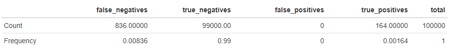

```{r, include = FALSE}
knitr::opts_chunk$set(
  collapse = TRUE,
  comment = "#>"
)
```

## Overview
GWAS is short for genome-wide association study, which is a method used to identify gene variations that are statistically associated with a risk for a disease. Once a large enough dataset has been collected, the approach is to look for genomic variants that occur more frequently in those with a given disease compared to those without the disease. GWAS in practice makes a simple linear regression on values at a particular SNP and the case-control statuses for each individual. This is then done for every SNP. We note that other implementations of GWAS exist, but that this simple implementation is the one used in RyouSick. Among other statistics, it gives us a P-value for every SNP indicating the statistical significance of our observations. In the figure below we illustrate which columns we would do a regression on to calculate the P-value and other statistics for the SNP x2.

{width=100%}

Using a chosen significance level we can then determine whether a SNP might be causal or not based on whether its P-value is higher or lower. 

## Example Run on 100,000x100,000 Dataset
When performing GWAS using the RyouSick package's `GWAS()` function on a large population of 100,000 individuals on 100,000 SNPs we receive the following statistics given that we randomly choose 200 SNPs between SNP 1 and SNP 12,500, 200 SNPs between SNP 37,500 and SNP 50,000 and 600 SNPs between SNP 75,000 and SNP 100,000 to be causal, with $h^2=0.8$ and a prevalence of 0.05: 



We note that to determine whether a SNP is causal or not we check to see if the P-value is lower or higher than the Bonferroni corrected significance level of $\frac{0.05}{100,000}=5\cdot10^{-7}$, given an alpha value of 0.05, since we perform 100,000 tests/regressions.

The results can also be visualized using a Manhattan plot that can be produced using the function `Manhattan_plot()` where SNPs over the dotted line represent SNPs that are counted as causal. 


This gives us an indication of where in the sequence the causal SNPs appear. We very clearly see that the GWAS analysis finds statistically significant SNPs in the SNP positions that we have chosen to be causal. A comparison between the results of the different association studies can be seen in the LTFH article `vignette("LTFH")`. 

