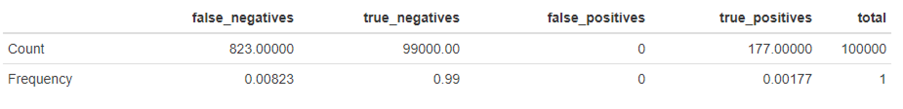

```{r, include = FALSE}
knitr::opts_chunk$set(
  collapse = TRUE,
  comment = "#>"
)
```

## Overview

GWAX is short for genome-wide association study by proxy, which is an approach used to identify genomic variants that are statistically associated with a risk for a disease, exactly as GWAS. The key difference is the regressand which GWAS uses to do simple linear regression on. GWAX makes a proxy case-control status based on the individual's family history. So if the individual's case-control status is zero, meaning not having the disease, but just one the individual's parents case-control status is one, meaning having the disease, the individual gets a proxy status of one. In other words any GWAX therefore accounts for some family history and heritability, which should give more useful information to the analysis. 


## Example Run on 100,000x100,000 Dataset
Using GWAX on the same simulated data that we analyzed in the GWAS article we get the following results

{width=100%}


We see that GWAX performs slightly better than GWAS with 177 true positives compared to 164 for GWAS. See a full comparison between all the methods in the LTFH article `vignette("LTFH")`. We refer the reader to the original paper on GWAX by Liu, J.Z. et al. (2017) for more information about the method.

## References

* Liu, J.Z., Erlich, Y., Pickrell. Case-control association mapping by proxy using family history of disease. Nat Genet, 49(3) p325-331 (2017). <https://pubmed.ncbi.nlm.nih.gov/28092683/>

