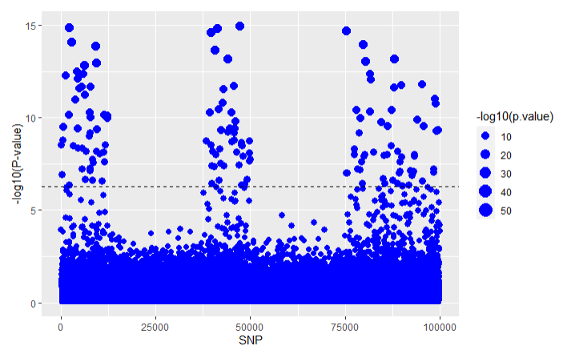
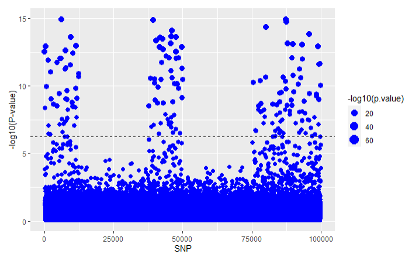
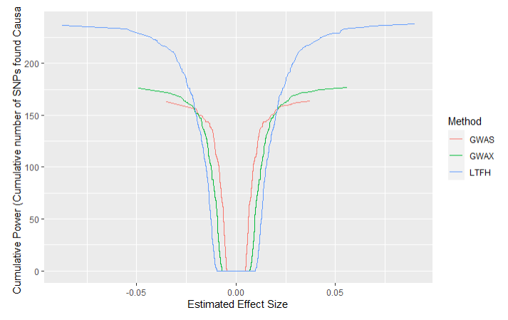

```{r, include = FALSE}
knitr::opts_chunk$set(
  collapse = TRUE,
  comment = "#>"
)
```

## Overview

LT-FH is short for liability threshold model, conditional on case-control status and family history (original paper by  Hujoel, M.L.A. et al (2020)). The approach in LT-FH is to assign posterior mean genetic liabilities for each individual given that prior information on case-control status for themselves and family (their configuration) is already known. This posterior liability can then be used to perform GWAS alongside genotyped data, giving us more information than what a two-leveled case-control status would. More broadly, LTFH expands upon the liability threshold model that was touched upon in the `vignette("Simulation_Basis")`.  In LTFH we now model the liabilities of our target individuals using the following multivariate normal distribution that takes the liabilities of family members into account:

$$\begin{bmatrix}
l_g \\
l_o \\
l_{p1} \\
l_{p2} \\
l_s \\
\end{bmatrix} \sim MVN_5\left( \begin{bmatrix}
0 \\
0 \\
0 \\
0 \\
0 \\
\end{bmatrix},\begin{bmatrix}
h^2 & h^2 &0.5h^2 & 0.5h^2& 0.5h^2\\
h^2 & 1 & 0.5h^2& 0.5h^2& 0.5h^2\\
0 &0.5h^2 & 1 & 0 & 0.5h^2\\
0 & 0.5h^2 & 0 & 1 & 0.5h^2\\
0 & 0.5h^2&0.5h^2 &0.5h^2 & 1\\
\end{bmatrix}\right)$$


Here $l_g$ is the target individuals genetic liability, $l_o$ their full liablilty, $l_{p1}$ the full liability of parent 1, $l_{p2}$ the full liability of parent 2 and $l_s$ the liability of a sibling. In the above the liabilities have been modeled using only 1 sibling. The model can be extended with more siblings by adding another row and column containing $0.5h^2$ in every entrance except the diagonal entrance which should be 1. 

To calculate the posterior mean genetic liabilities RyouSick Gibbs samples genetic liabilities from the above distribution. This specific approach is a light implementation of method for calculating posterior mean genetic liabilites outlined the LT-FH++ method (see Pedersen, E.M. et al (2022)). It takes advantage of the fact that by calculating conditional liabilities in the Gibbs sampling process, fx. $l_g$ conditional on $l_o, l_{p1},l_{p2} \text{ and }l_s$, we can get samples and sample means from our multivariate distribution much easier than using integration. In more detail we also take case-control status into account by sampling from truncated conditional normal distributions. This kind of distribution is derived from that of a normally distributed random variable by bounding it from either below or above. When applying the information about the case-control status, we are able to bound the distribution from below when the status for an individual is a case, and from above when not a case. Once the Gibbs sampling process converges to the target distribution for our configuration, which we check by evaluating the SEM (standard error of the mean), we begin to sample the genetic liabilities from the converged distribution. These are then used to calculate our posterior mean genetic liability for any given configuration.

Since we only have to sample a mean genetic liability for each configuration that we look at, which is made from the status of parents, child and siblings, and not for every genotype, as two genotypes can have the same configuration, posterior mean genetic liabilities can be calculated relatively quickly. When the posterior mean genetic liabilities have been calculated for all configurations available in our data we match it to the individuals in our dataset and finally perform GWAS on the genotypes and the posterior mean genetic liabilities.

## Example run on 100,000x100,000 dataset and comparison with results from GWAS and GWAX

Using the LT-FH approach on the same simulated data that we analyzed in the GWAS and GWAX articles we get the following results for all three methods: 

For GWAS - 


For GWAX - 



For LTFH - 



Stats for GWAS, GWAS and LTFH respectively: 

{width=100%}

Additionally we get the following power plots: 



We see that the LT-FH method as expected performs better at finding true positives than both GWAS and GWAX. From the power plot we also see that LTFH is better at sorting out insignificant information, as the curve for LTFH begins to grows at larger (both negativly and postively) estimated effect sizes than GWAS and GWAX. 

## References 

* Hujoel, M.L.A., Gazal, S., Loh, P. et al. Liability threshold modeling of case-control status and family history of disease increases association power. Nat Genet, 52(5) p541-547 (2020). <https://pubmed.ncbi.nlm.nih.gov/32313248/> 

* Pedersen, E.M., Agerbo, E., Plana-Ripoll, et al. Accounting for age of onset and family history improves power in genome-wide association studies. The American Journal of Human Genetics, Volume 109, issue 3, P417-432  (2022). <https://www.cell.com/ajhg/fulltext/S0002-9297(22)00009-X/>

