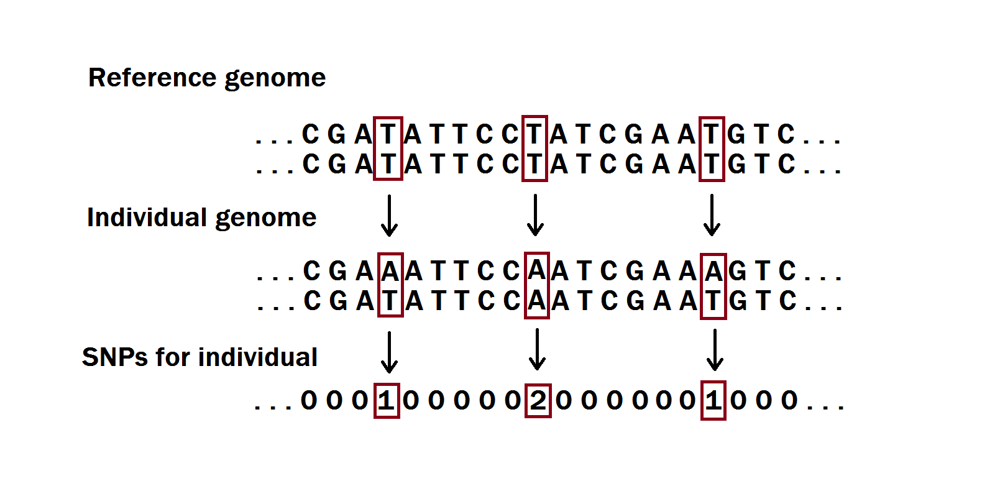

```{r, include = FALSE}
knitr::opts_chunk$set(
  collapse = TRUE,
  comment = "#>"
)
```

## Simulating Genotypes
Genetic data such as DNA can be represented in various ways. The most common way to do it is to list the sequence of  nucleotides (A - adenine, G - guanine, C - cytosine, T - thymine) that appear at each position of the DNA. These always appear in pairs and an example of such a sequence could be AAGGTTCGTTCG. In the RyouSick package, instead of working with character sequences like these, which are also called genome sequences, we go straight to working with a more processed version of the sequence composed of single nucleotide polymorphisms (abbreviated SNPs and pronounced snips). SNPs give an indication of the genetic variation at a single base position in the DNA. Since the nucleotides appear in pairs, any deviation from the reference genome at a given position can be represented using either a 0, 1 or 2. Let's say that a pair in the human reference genome at a specific position is TT. If our target individual has TT at the same position in their genome, we write that the SNP is 0, if they have TA (one deviation) we write 1 and if they have CC (2 deviations) we write 2. As such we would be able to represent the genomic sequence as something like 001201, only taking up half the storage space. This is also visually shown in the figure below.

{width=100%}

We refer to such a sequence as the individual's genotype. 

Each SNP has a certain probability of deviating from the reference. This is known as the minor allele frequency or MAF. To simulate individuals in our package we sample the MAF for each SNP from a uniform distribution so that $MAF_j \sim unif_j(0.01, 0.49)$ (although options are given to input a custom MAF vector). The values $x_j$ for each SNP position j in a genotype $X$ is then sampled from a binomial distribution so $x_j \sim binom(2, MAF_j)$.

## Liability Threshold Modeling
When assigning a disease status, also known as case-control phenotype, to our genotypes, we make use of liability threshold modeling. The disease liability, which is used to determine an individual's likelihood of having a disease, is modeled using two components, a genetic and an environmental. The genetic component is distributed as $l_g \sim N(0, h^2)$ , where $h^2$ is the heritability of a given disease and the environmental factor (the noise) as $l_e\sim N(0,1-h^2)$. As such the full liability of an individual sums to $l_o = l_g + l_e \sim  N(0,1)$. While the environmental component can be sampled, we calculate the genetic liability using  $X^T \beta$, where $X$ is the individual’s genotype and $\beta$ is the effect size of each SNP. The $\beta$ value for each SNP is sampled from $N(0,\frac{h^2}{c})$ when we have a causal SNP, where c is the number of causal SNPs in our target sequence, and is 0 whenever a SNP is not causal. When the full liability has been calculated, we assign a case control status to the individual based on the prevalence of the disease in our population. Say there is a prevalence of 5% in the population, we then determine the threshold for being case as the upper 5% quantile of  $l_o \sim N(0,1)$, e.g. 1.645. Any genotype with a $l_o$ over 1.645 will then be assigned case and all others not case. 

## Simulating Family Genotypes
To simulate the children and siblings in our functions, we first simulate two parent genotypes and find their average genotype. Different children can then be generated from these average genotypes by sampling randomly from $\{1,2\}$ whenever a SNP is 1.5 or $\{0,1\}$ whenever a SNP is 0.5. At the same time we also look for cases where both parents have a 1 at a SNP in which case we sample randomly from $\{0,1,2\}$. Case-control status is then assigned using liability threshold modeling.


